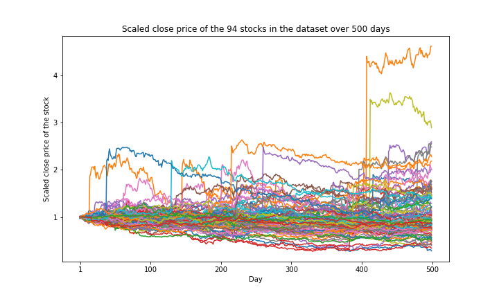

### status: under development
# Motivation
Is there any pattern in the day to day movement of the stock prices? Can we build a successful trading strategy based on this insight?
The motivation of this project is to replicate the results of the [repository of Buffalo Capital Management](https://github.com/wzchen/stock_market_prediction) and see if markets are still predictable in 2021. The original Kaggle competition is [here](https://www.kaggle.com/c/boston-data-festival-hackathon).
 - Given the opening, closing, min, max, and volume of a stock in the previous 9 days (and given the opening price of a stock on day 10) can we predict the directional movement of a stock on day 10?

# Files
- **process.ipynb**: A Jupyter Notebook describing my work.
- **datasets/ohlc_data.csv**: A csv file containing opening, closing, min, max, and volume of 94 stock in 500 days. The first opening date price is scaled to 1.

# Insights
It seems that the closing price is negatively correlated to the upward/downward movement of the last day's price.

# Performance

# Future works
What would the performance look like in 2021?